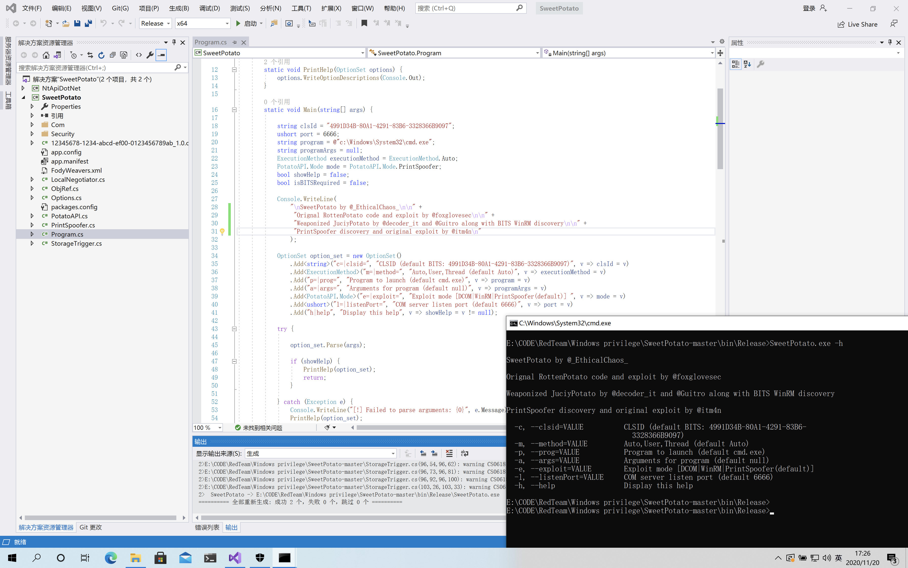

# SweetPotato 
### A collection of various native Windows privilege escalation techniques from service accounts to SYSTEM

```
SweetPotato by @_EthicalChaos_

Orignal RottenPotato code and exploit by @foxglovesec
  
Weaponized JuciyPotato by @decoder_it and @Guitro along with BITS WinRM discovery
  
PrintSpoofer discovery and original exploit by @itm4n
  
  -c, --clsid=VALUE          CLSID (default BITS: 4991D34B-80A1-4291-83B6-
                               3328366B9097)
  -m, --method=VALUE         Auto,User,Thread (default Auto)
  -p, --prog=VALUE           Program to launch (default cmd.exe)
  -a, --args=VALUE           Arguments for program (default null)
  -e, --exploit=VALUE        Exploit mode [DCOM|WinRM|PrintSpoofer(default)]
  -l, --listenPort=VALUE     COM server listen port (default 6666)
  -h, --help                 Display this help
```

# 甜土豆🥔

### 从`service accounts` 服务帐户到`SYSTEM`的各种本机Windows特权升级技术的集合

```
@foxglovesec的Orignal 烂土豆RottenPotato代码和利用
@decoder_it和@Guitro通过BITS WinRM发现武器化的 多汁JuciyPotato
@itm4n的PrintSpoofer发现和原始利用
```




`SweetPotato-CCob\NtApiDotNet\bin\Release\NtApiDotNet.dll`

`SweetPotato-CCob\bin\Release\SweetPotato.exe`


